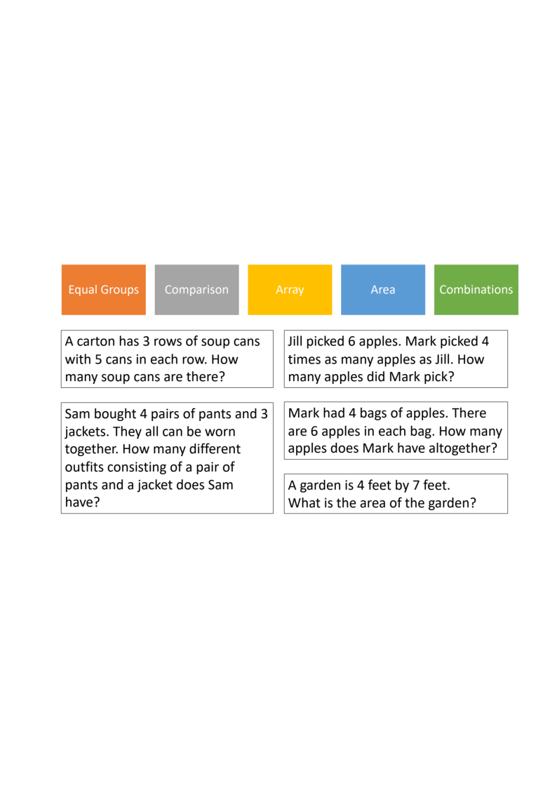
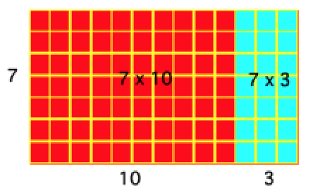
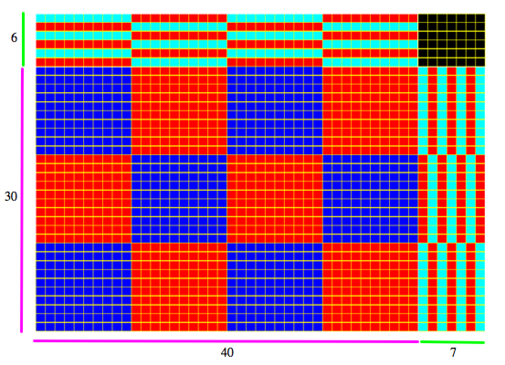

# E343 Unit 3 — Course Packet

**Spring 2026**

---

## Week 9, Day 1

### Class Discussion → Addition & Subtraction Operation Sense

#### Vertical Articulation: K–3 Standards

For each grade band, identify what students are expected to know and do regarding addition and subtraction. Record the relevant standards and note how expectations change across grades.

| Kindergarten — Number Sense |
|:---|
| &nbsp; |

| Kindergarten — Computation & Algebraic Thinking |
|:---|
| &nbsp; |

| 1st Grade — Number Sense |
|:---|
| &nbsp; |

| 1st Grade — Computation & Algebraic Thinking |
|:---|
| &nbsp; |

| 2nd Grade — Number Sense |
|:---|
| &nbsp; |

| 2nd Grade — Computation & Algebraic Thinking |
|:---|
| &nbsp; |

| 3rd Grade — Computation & Algebraic Thinking (Multiplication Focus) |
|:---|
| &nbsp; |

| **What standards did we not fully understand the meaning of?** |
|:---|
| &nbsp; |

| **What is gone from 2nd and 3rd grade that was there in a previous grade (i.e., assumed to be learned)?** |
|:---|
| &nbsp; |

| **What is new in 2nd and 3rd grade that was not there in the previous grade? (Pay attention to number range, not just standard.)** |
|:---|
| &nbsp; |

---

## Week 10, Day 1

### Class Discussion → Addition Number Talk Video & Multiplication Vertical Articulation

#### Video: Addition Number Talk (8 + 6)

Watch the [video](https://iu.mediaspace.kaltura.com/media/t/1_we5lzr9q) and record student strategies.

| Record student strategies for 8 + 6 |
|:---|
| &nbsp; |

| Teacher moves |
|:---|
| &nbsp; |

#### Vertical Articulation: Multiplication Standards (K–3)

| Kindergarten |
|:---|
| &nbsp; |

| 1st Grade |
|:---|
| &nbsp; |

| 2nd Grade |
|:---|
| &nbsp; |

| 3rd Grade |
|:---|
| &nbsp; |

| **What standards did we not fully understand?** |
|:---|
| &nbsp; |

| **What is gone from 2nd/3rd grade that was in a previous grade?** |
|:---|
| &nbsp; |

| **What is new in 2nd/3rd grade?** |
|:---|
| &nbsp; |

---

## Week 10, Day 2

### Class Discussion → Multiplication and Division Operation Sense

#### Part A: Problem Types

The five problem types that Van de Walle discusses are in the colored boxes at the top. Identify which problem type goes with which contextualized problem listed below.



#### Part B: Unknown Parts and Equations

For each task, classify the problem according to problem type, what is known and unknown, and write an equation for each. Make sure to be specific about whether a problem is multiplication, sharing (partition) division, or measurement (quotative) division (pp. 172–173).

| Tasks | Problem Type, Unknown, Equation |
|:---|:---|
| **1.** Holly has 30 marbles. She placed 5 marbles in a row. How many rows could she make? | &nbsp; |
| **2.** Holly has 42 marbles. She puts them into 6 rows. How many marbles are in each row? | &nbsp; |
| **3.** John has 28 cookies total. He has 4 packages. How many cookies are in each package? | &nbsp; |
| **4.** Nancy had 48 books from the library. She returned 6 books each day until all her books were returned. How many days did it take? | &nbsp; |
| **5.** John earns 3 times as much money as Jack in a week. John earns 12 dollars a week. How much money does Jack earn in a week? | &nbsp; |
| **6.** John earns 36 dollars in a week. Jack earns 12 dollars in a week. In a week, how many times the amount of money does John earn than Jack? | &nbsp; |
| **7.** My rectangular garden is 20 square feet. One of its sides is 4 feet long. How long is the other side? | &nbsp; |

#### Part C: Modeling Problems

*Now put yourself in the role of a teacher.* Consider a model that you would use to represent **four** of the problems on the previous page. Make a representation (pp. 173, 174, 177, 179) that makes sense for the problem structure. Write a multiplication or division statement for each problem that follows Van de Walle et al.'s convention for symbolizing problems (p. 175, bottom, "The U.S. convention is that…")

| Problem 1 | Problem 2 |
|:---|:---|
| &nbsp; | &nbsp; |

| Problem 3 | Problem 4 |
|:---|:---|
| &nbsp; | &nbsp; |

---

## Week 11, Day 1

### Class Discussion → Multiplication Fact Teaching

#### Observe, Reflect, Advise

[Video](https://iu.mediaspace.kaltura.com/media/t/1_84eifhh3) we will watch together. Answer the first question WHILE you're watching the video!

| **Record the order the teacher presented the problems in.** |
|:---|
| &nbsp; |
| ***Discuss and then comment:* What order did the teacher present the problems in?** |
| **How does the order that the teacher presents the problems support student strategy usage?** |

| ***Discuss and then comment:* What representations did the teacher use? Are all of them equally useful?** |
|:---|
| &nbsp; |
| ***Discuss and then comment:* When teaching math, we typically keep all student thinking visible as much/long as possible. This teacher erased student thinking after each problem. This was an intentional move. What reasons (both pedagogical and practical) do you think she had for doing that? What are your thoughts about her decision?** |
| **What advice would you give this teacher about selecting and sequencing student solutions?** |

#### Create an Instructional Plan for Learning Basic Multiplication Facts

Using the Van de Walle et al. reading and our discussion of the video, your job is to make an instructional plan for how you would organize learning basic multiplication facts.

##### 1. Big Picture Planning

| Give a "big picture" view of the order in which you would have students work on their multiplication facts. Use Van de Walle et al. to state why certain numbers would precede others (pp. 204–207). |
|:---|
| &nbsp; |

##### 2. Consistency

State how you will interpret the symbols 4 × 8: is it 4 groups of 8 OR 8 groups of 4? Write down how you would interpret each symbolic statement below making sure you are CONSISTENT across all.

| Expression | Interpretation |
|:---|:---|
| 4 × 8 | &nbsp; |
| 8 × 4 | &nbsp; |
| 9 × 6 | &nbsp; |
| 5 × 7 | &nbsp; |

##### 3. Anticipating Student Reasoning: Addition or Multiplication?

Sometimes students aren't sure when to use addition and when to use multiplication. You anticipate that students might add instead of multiply when they are given "naked number" problems, such as 8 × 7. Provide two SPECIFIC examples (or activities) for how you would help a student understand that 8 × 7 is multiplication rather than addition.

| Example 1 |
|:---|
| &nbsp; |

| Example 2 |
|:---|
| &nbsp; |

##### 4. Specific Strategy Support

Suppose you are working with students on "6 facts" (that is, one group of 6, two groups of 6, three groups of 6, and so on). You want to support strategy usage (see pp. 208–209).

1. State five "6 facts" and the order in which you would present them.
2. Based on the order you present the facts, state what strategy you are hoping a student might use.

| 6 Facts in Order of Presentation | Strategy/Strategies Students Might Use |
|:---|:---|
| &nbsp; | &nbsp; |
| &nbsp; | &nbsp; |
| &nbsp; | &nbsp; |
| &nbsp; | &nbsp; |
| &nbsp; | &nbsp; |

##### 5. Assessment Plan

Van de Walle et al. recommend that students monitor their own progress. State how you will keep track of student progress in a way that takes into account that students should be helping to monitor *their own* progress.

| &nbsp; |
|:---|
| &nbsp; |

##### 6. Enjoyment

Van de Walle et al. recommend making facts practice enjoyable. Make a plan for doing this.

| **Describe, in detail, one game that is presented in the chapter.** |
|:---|
| &nbsp; |
| **Would you want the game to be competitive or collaborative? Why?** |
| &nbsp; |
| **How would you differentiate for different students in the context of the game?** |
| &nbsp; |

---

## Week 11, Day 2

### Class Discussion → Multiplication Strategies and Standard Algorithm for Multiplication

| **Use a Complete Number Strategy for 7 × 53** |
|:---|
| &nbsp; |

| **Use a Partitioning Strategy to solve 6 × 28** |
|:---|
| &nbsp; |

| **Use a Compensation Strategy to solve 7 × 37** |
|:---|
| &nbsp; |

| **Write a set of Cluster Problems for 32 × 29** |
|:---|
| &nbsp; |

### Instructor Led

The multiplication algorithm is based on the distributive property. Students usually first apply it for two-digit times one-digit numbers. The goal is to continue to emphasize place value and meaning when working on the algorithm.

#### Example: 13 × 7

We can use **base ten blocks** arranged as **arrays** to model multiplication.



**Over time** we can work to compress notation to help students understand, but it is good to start with less compressed notation rather than more compressed notation.

**Step 1:** Write notation that shows place value explicitly

```
  (10 + 3)
×       7
--------
      21
  +   70
--------
      91
```

Written in algebra as: 7 × (10 + 3) = 70 + 21 = 91

**Step 2:** Show each partial product in notation

```
    1 3
  ×   7
  -----
    2 1
  + 7 0
  -----
    9 1
```

**Notation I do NOT recommend:** Fully compressed notation is unhelpful because students focus on digits rather than place value, there is no connection to future mathematics, and students do not usually understand the size of the product.

#### Partner Work: 14 × 8

| Use base ten blocks to make an array. Then draw a picture of your base ten blocks below. |
|:---|
| &nbsp; |

**Write** down the explanation you gave to your partner of your base ten array model.

**Write** notation for 14 × 8 shown in Step 1 and Step 2 above.

| Step 1 | Step 2 |
|:---|:---|
| &nbsp; | &nbsp; |

**Write** down what you would say as a teacher as you are writing the Step 2 notation.

### Two-Digit × Two-Digit: 47 × 36

The standard algorithm for a two-digit number times a two-digit number involves taking four partial products. The picture below shows the four partial products as well as how you could make an array with base ten blocks.



[Watch the video](https://iu.mediaspace.kaltura.com/media/t/1_w4f7teg1) and record the four partial products that Nikolas takes for the problem and record the strategy that Nikolas uses for each partial product.

| Partial Product | Strategy |
|:---|:---|
| **Product 1:** | &nbsp; |
| **Product 2:** | &nbsp; |
| **Product 3:** | &nbsp; |
| **Product 4:** | &nbsp; |

**Step 1:** Make place value explicit

```
  (40 + 7)
× (30 + 6)
----------
        42
       240
       210
  +  1200
----------
     1692
```

Written in algebra as: (40 + 7) × (30 + 6) = 1200 + 240 + 210 + 42 = 1692

**Step 2:** Show all partial products

```
      4 7
  ×   3 6
  -------
      4 2
    2 4 0
    2 1 0
+ 1 2 0 0
---------
  1 6 9 2
```

#### Partner Work: 24 × 23

| Draw an array using base ten blocks below. Make sure to label your array. |
|:---|
| &nbsp; |

**Write** down what you said to your partner as you made the model.

**Write** notation for 24 × 23 shown in Step 1 and Step 2 above.

| Step 1 | Step 2 |
|:---|:---|
| &nbsp; | &nbsp; |

**Write** down what you would say as a teacher as you are writing the Step 1 notation. Share with your partner.

---

## Week 12, Days 1 & 2

### Class Discussion → Teaching Division: Two Different Ways to Record Division Problems

**Teaching structure:** A common structure for teaching is to have students model problems first with manipulatives AND THEN create a written record. We are going to compare what Van De Walle talks about as sharing (partition) division and measurement division, looking across grade levels to see how these ideas develop. Both measurement and sharing division are explicitly referenced in standards and the recording of them and thinking for them is different.

#### 4th Grade: Sharing & Measurement Division Problems

| Sharing | Measurement |
|:---|:---|
| Use the base ten blocks to show sharing 684 among 6 people. | A school buys 384 pencils. They plan to give 6 pencils to each student. How many students are there? |

| Sharing | Measurement |
|:---|:---|
| A fabric company orders 359 yards of fabric. The owner distributes the fabric among 7 stores. How many yards of fabric does each store get? | A baker baked 889 cookies for the holidays. She puts them into bags of 7 cookies each. How many bags can she make? |

**Compare how measurement and sharing division are different:**

| &nbsp; |
|:---|
| &nbsp; |

#### 5th Grade: Sharing & Measurement Division Problems

| Sharing | Measurement |
|:---|:---|
| A bank has \$1456 to give evenly to 13 people. How much money does each person get? | To park for the football game each car has to pay \$13. A parking attendant collects a total of \$1586. How many cars parked in the lot? |

#### 6th Grade: Modeling the Division Algorithm Using Sharing Division

| Sharing | Measurement |
|:---|:---|
| A bank has \$1456 to give evenly to 13 people. How much money does each person get? | To park for the football game each car has to pay \$13. A parking attendant collects a total of \$1586. How many cars parked in the lot? |

#### 6th Grade: Record using the method shown on the previous page

| Sharing | Measurement |
|:---|:---|
| *Try Problem 1 if less confident, Problem 2 if somewhat confident, Problem 3 if very confident. If you finish, complete the others and compare.* | *Try Problem 1 if less confident, Problem 2 if somewhat confident, Problem 3 if very confident. If you finish, complete the others and compare.* |
| **Problem 1:** 6 students are doing a science experiment. They need to share 876 milliliters of water. How many milliliters does each student get? | **Problem 1:** 276 students attend Summit elementary. The school is making teams of 6 students for a school-wide event. How many teams will they have? |
| **Problem 2:** 1452 M&Ms are distributed to 11 bags (same number in each). How many M&Ms are in each bag? | **Problem 2:** A bakery bakes 657 cookies. A baker packs them into packages of 9 cookies. How many packages can they make? |
| **Problem 3:** 2655 M&Ms are distributed to 27 bags (same number in each). How many M&Ms are in each bag? | **Problem 3:** A farmer collects 1584 chicken eggs in a week. She packs the eggs into packages of 12. How many packages does she make? |
